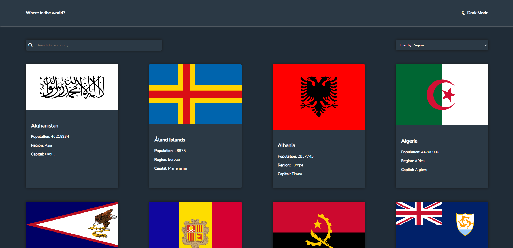
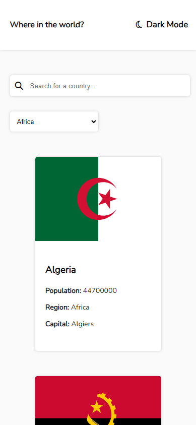

# Frontend Mentor - REST Countries API with color theme switcher solution

This is a solution to the [REST Countries API with color theme switcher challenge on Frontend Mentor](https://www.frontendmentor.io/challenges/rest-countries-api-with-color-theme-switcher-5cacc469fec04111f7b848ca).

## Table of contents

- [Overview](#overview)
  - [The challenge](#the-challenge)
  - [Screenshot](#screenshot)
  - [Links](#links)
- [My process](#my-process)
  - [Built with](#built-with)
  - [What I learned](#what-i-learned)
  - [Continued development](#continued-development)

## Overview

### The challenge

Users should be able to:

- See all countries from the API on the homepage
- Search for a country using an `input` field
- Filter countries by region
- Click on a country to see more detailed information on a separate page
- Click through to the border countries on the detail page
- Toggle the color scheme between light and dark mode

### Screenshot

### Desktop Version (Dark Mode)

### Mobile Version (Light Mode)

### Links

- Live Site URL: [Click Here](https://xcordeva.github.io/countries-api-with-theme-switcher-FrontendmentorChallenges)

## My Process

### Built With

- HTML5
- CSS3
- JavaScript
- Fuse.js

### What I Learned

While working on this project, I learned:

- How to fetch and display data from a REST API.
- Implementing search and filter functionalities.
- Creating a responsive and user-friendly UI.
- Theme switching using CSS variables.

### Continued Development

In the future, I plan to:

- Implement pagination for better navigation through the country list.

